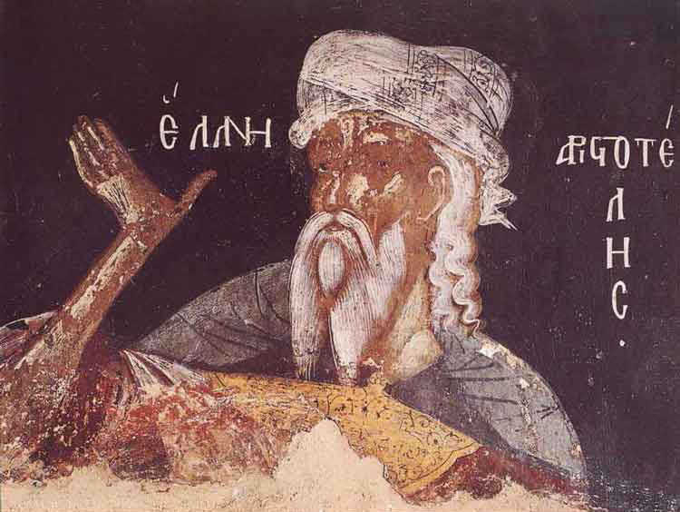

<!-- {} -->

## Course Description

Aristotle famously endorses _hylomorphism_, the thesis that "substances" are composites of form (_morphê_, _eidos_) and matter (_hulê_). Initially, Aristotle seems to have proposed a hylomorphic conception of substance to deal with certain challenges to the possibility of change, in particular _substantial_ change, in which there comes to be a human or a house from what was not one before. But the impact of this thesis on Aristotle's thought extends far beyond the resolution of these challenges, influencing most crucially his theory of being in _Metaphysics_ Z, his explanation of life in _De Anima_, and the whole of the biological theory he develops in the _Parts_ and _Generation of Animals_.

This course will be an in-depth examination of Aristotle's hylomorphism, its theoretical motivations, and its philosophical difficulties. We will read widely from Aristotle's works in metaphysics and natural science, while drawing on both recent scholarly and neo-Aristotelian treatments of Aristotle's account of substance.

## Course Objectives

The course aims to establish a broad understanding of core issues in Aristotle's metaphysics and natural science and to develop the skills necessary for appreciating these and related issues in ancient and contemporary philosophy.

## Learning Outcomes

The successful student will demonstrate the ability:

- to state and articulate, verbally and in writing, major ideas and controversies related to Aristotle's hylomorphism,
- to read and critically assess relevant primary and secondary literature,
- to apply these skills to novel cases.

{}
If you keep up with the lectures and readings you will not be assigned anything for which you are unprepared!
{}

## Course Components

Students' success in meeting these course goals will be evaluated on the following bases:

- **Undergraduate students** will be expected to write **two passage commentaries** of roughly 7 pages each. The commentaries are designed to stimulate in-depth historical and philosophical engagement with one of the major passages discussed in class and the relevant secondary literature. Undergraduates who earn an A- or higher on their first commentary can petition to write a roughly 7 page **term paper** (Term Paper 2 style; see below) in lieu of a second commentary.

- **Graduate students** will be expected to write three 5--7 page **term papers**, each addressing a substantive interpretive issue concerning Aristotle's metaphysics, natural science, and/or related philosophical issues. These papers are intended to be exercises in advanced philosophical writing, so students will be responsible for submitting substantial **outlines** and **preliminary drafts**, on which I will provide comments aimed at helping the student compose a well-written and cogently argued **final draft**. Additionally, students will be given progressively greater discretion over the subject of their papers over the course of the term:
  - **Term Paper 1** topics will be chosen from a list of prompts given by me.
  - **Term Paper 2** topics may _either_ be chosen from a list of prompts given by me _or_ proposed by the student in consultation with me.
  - **Term Paper 3** topics _must_ be proposed by the student in consultation with me.

- **Participation** will be evaluated on the basis of student participation in discussions both in lecture meetings and outside of lecture meetings in the course chat (see below). 

<!-- - Class participation will be evaluated on the basis of the student's answer to periodic **reading response questions**, which will be distributed in advance and must be turned in prior to the start of the meeting in which the relevant reading is to be discussed. (Students may opt out of reading responses with no penalty a maximum of _three_ times; students who do not opt out of three reading responses may use these to replace lower-scoring responses; with the exception of University excused absences, which must be supported by official documentation, students must complete all other reading responses and attend all other class meetings.) -->

- Finally, undergraduate students will make one, and graduate students two, 10--15 minute **in-class presentations**. Students due to present in a given week will also be required to post three reading questions to the course chat no later than the Tuesday of that week. 

## Evaluation

Final grades will be determined according to the following rubrics:

### Undergraduate Students

| **Assignment**  | **% of Final Grade**          |
|-----------------|-------------------------------|
| Commentary 1    | 25%                           |
| Commentary 2    | 35%                           |
| Presentations   | 20%                           |
| Participation   | 20%                           |
| **Total**       | **100%**                      |

### Graduate Students

| **Assignment**                 | **% of Final Grade** |
|--------------------------------|----------------------|
| Term Paper 1 Outline           |                   7% |
| Term Paper 1 Preliminary Draft |                   8% |
| Term Paper 1 Final Draft       |                   5% |
| Term Paper 2 Outline           |                   5% |
| Term Paper 2 Preliminary Draft |                   7% |
| Term Paper 2 Final Draft       |                   8% |
| Term Paper 3 Outline           |                   5% |
| Term Paper 3 Preliminary Draft |                   5% |
| Term Paper 3 Final Draft       |                  10% |
| Presentations                  |                  20% |
| Participation                  |                  20% |
| **Total**                      |             **100%** |

{}
You must complete _all_ assignments in order to pass the course!
{}

#### Grading Scale

| **Score** | **Grade** | **Performance**                                                     |
|-----------|-----------|---------------------------------------------------------------------|
|   96--100 | **A+**    | _Surpasses All Grading Criteria_                                    |
|    90--95 | **A**     | _Satisfies All Grading Criteria; No Errors_                         |
|    87--89 | **A-**    | _Satisfies All Grading Criteria; At Least One Minor Error_          |
|    83--86 | **B+**    | _Satisfies Most Grading Criteria; Minor Errors_                     |
|    80--82 | **B**     | _Satisfies Most Grading Criteria; Perhaps Some Major Errors_        |
|    77--79 | **B-**    | _Satisfies Most Grading Criteria; One or More Major Errors_         |
|    73--76 | **C+**    | _Satisfies Some Grading Criteria; Some Major Errors_                |
|    70--72 | **C**     | _Satisfies Some Grading Criteria; Several Major Errors_             |
|    67--69 | **C-**    | _Satisfies Some Grading Criteria; Many Major Errors_                |
|    64--66 | **D+**    | _Satisfies Almost No Grading Criteria; At Least One Critical Error_ |
|    60--63 | **D**     | _Satisfies Almost No Grading Criteria; One or More Critical Errors_ |
|     0--59 | **F**     | _Satisfies No Grading Criteria, Incomplete, or Plagiarized_         |

{}
Final grades are rounded up from the 2nd decimal place; no exceptions will be made.
{}

## Texts & Course Materials

### Required Texts

Primary sources will be drawn from throughout Aristotle's corpus. Required readings will be posted to Blackboard and shared via the course chat room. Students looking for reliable English translations of Aristotle's are encouraged to consult: 

- Barnes, Johnathan (ed.). 1984. _The Complete Works of Aristotle: Revised Oxford Translation_. 2 vols. Princeton, NJ: Princeton University Press.

### Additional Materials

Scholarship on ancient epistemology since the late 20^th^ century has been for the most part excellent. Students seeking additional resources are encouraged to consult the bibliographies included with relevant entries in the [_Stanford Enclyclopedia of Philosophy_](plato.stanford.edu).

<!-- , as well as the following resources, which are on hold at the library: -->

<!-- - Algra, Keimpe, ed. 1999. _The Cambridge History of Hellenistic Philosophy_. Cambridge: Cambridge University Press. -->
<!-- - Schofield, Malcolm, Myles Burnyeat, and Jonathan Barnes, eds. 1980. _Doubt and Dogmatism: Studies in Hellenistic Epistemology_. Oxford: Clarendon Press. -->
<!-- - Annas, Julia and Jonathan Barnes, eds. 2000. _Sextus Empiricus: Outlines of Scepticism_. Cambridge: Cambridge University Press. -->
<!-- - Bett, Richard, ed. 2005. _Sextus Empiricus: Against the Logicians_. Cambridge: Cambridge University Press. -->

## Course Policies

### Announcements & Class Discussion

We will use the Google Chat client for all announcements and class discussion. You will be added to the course chat room towards the end of the first week.

### Office Hours & Appointments

Office hours and appointments will also be held [via Zoom <i class="fas fa-video"></i>](https://kocun.zoom.us/my/rhowton).

### Email Policy

Feel free to ask questions to me or your classmates in the class chat, via either public or private messages. If you must email me, please allow me two business days to respond. Please do not email me with questions of philosophical substance---that is what lecture, discussion, and office hours are for---and please consult this syllabus before asking questions about course policy.

### Late Submission Policy

Late submissions will be penalized 1/3 of a letter grade (e.g., from A to A-) per day late. I often permit extensions, but _you must ask me in advance of the due date_. 

### Disabilities and Different Styles of Learning

Education is a pluralistic enterprise: there are several and often incompatible styles of learning. If you believe there is an alternative approach to this material that would better suit your style of learning, do not hesitate to bring it up with me. If you have a disability for which you are or may be requesting accommodation, you are encouraged to contact both me and the Office of Disability Services at [0 (212) 338 10 42 <i class="fas fa-phone"></i>](tel:+90(212)3381042) as early as possible in the term. ODS will verify your disability and determine reasonable accommodations for this course.

### Academic Honesty

The goal of this course is to promote and assess _your_ satisfaction of the above-stated course objectives. Cheating not plagiarism will not be tolerated. Students suspected of violating the University's policy on academic integrity, noted below, will be required to participate in the required procedural process as initiated by the instructor. **A minimum sanction of a zero score for the quiz, exam, or paper will be imposed.**

{}
Be sure you are familiar with KU's complete policy on academic honesty, which is available in the [Student Code of Conduct <i class="fas fa-external-link-alt"></i>](https://apdd.ku.edu.tr/en/academic-policies/student-code-of-conduct/)
{}

### Important Links

- [Student Rights & Responsibilities <i class="fas fa-external-link-alt"></i>](https://apdd.ku.edu.tr/en/academic-policies/student-code-of-conduct/)

- [Academic Grievance Procedure <i class="fas fa-external-link-alt"></i>](https://apdd.ku.edu.tr/en/academic-policies/academic-grievance-procedure/)

- [Classroom Code of Conduct <i class="fas fa-external-link-alt"></i>](https://vpaa.ku.edu.tr/en/classroom-code-of-conduct/)
