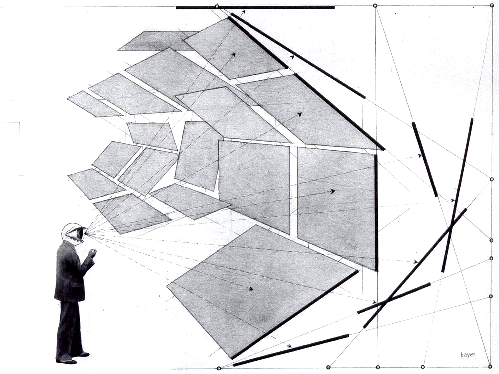

<!-- --- -->
<!-- # Page title -->
<!-- title: "Illusion: When Appearances Deceive" -->

<!-- # Title for the  menu link if you wish to use a shorter link title -->
<!-- linktitle: Syllabus -->

<!-- #Date page published -->
<!-- date: 2018-12-02T10:23:40+03:00 -->

<!-- draft: false -->
<!-- toc: true -->
<!-- type: book  # Do not modify. -->

<!-- # Position of this page in the menu. Remove this option to sort alphabetically. -->
<!-- weight: 1 -->

<!-- # Add menu entry to sidebar -->
<!-- # [menu.illusion] -->
<!-- #  name = "Syllabus" -->
<!-- #  weight = 1 -->
<!-- --- -->

<!-- {}  -->

## Course Description

We think we see the world around us as it is. Sometimes, however, things are not as they appear. We see a straight stick in the water as bent, or are taken in by a vivid dream or hallucination, or treat as reliable a source that turns out to peddle fake news. How do these various illusions impact our efforts to learn from experience? What strategies can we adopt---as individuals, as researchers, and as citizens---to combat these sorts of error? And what happens when things go right, when our senses teach us how the world really is? This course will explore these and similar questions concerning illusions in their many forms, drawing on resources past and present from philosophy, psychology, neuroscience, and the sociology of science.

## Course Objectives

This course aims to help students:

1. Gain an appreciation for the various forms of illusion and perceptual error and their significance in our cognitive lives;
2. Come to understand the cultural and historical influences shaping our notions of illusion, perception, and reality; and
3. Think freely and critically about how these issues affect them as individuals, researchers, and citizens.

## Learning Outcomes

By the end of the course, the successful student will have demonstrated the ability to:

- express philosophical ideas clearly, both verbally and in writing;
- read and critically assess philosophical and other academic literature;
- identify the elements of an argument and assess it for soundness and validity; and
- apply these skills to novel cases.

The key to success in this course is to keep up with the assigned readings and to attend and participate regularly in class activities.

{}
If you keep up with the lectures and readings you will not be assigned anything for which you are unprepared!
{}

## Course Logistics

This course will be taught remotely this semester. In accordance with [University guidelines](https://confluence.ku.edu.tr/kuhelp/ithelp/remote-teaching-and-learning), all class meetings will be held on Zoom, recorded, and posted to the course Blackboard page after the fact. This policy is intended to accommodate students who are unable to attend class meetings when they are held, _not as a substitute for attendance and participation in class meetings_. 

Class time will be divided between **lecture meetings**, which will take place Tuesdays and Thursdays, and **discussion meetings**, which will take place on Fridays.

- The purpose of **lecture meetings** is to introduce course material and prepare you for reading the texts assigned for that Unit. **You should come to the first lecture meeting of the week having engaged with the preparatory material; after the first meeting, you'll be in a position to start with the assigned reading.**
- The purpose of **discussion meetings** is to give you the opportunity to discuss ideas and problems arising from the lecture and assignments with a smaller group of your peers. Discussions will be led by one of the course TAs. **You should come having completed the readings and other assignments due that week. Ideally, you will also come with questions for discussion. Attendance at these meetings is mandatory and enforced by weekly quizzes.** 

<!-- {} Philosophy is, and has always been, a _discursive_ enterprise. Without testing your understanding of the ideas and theories you're exposed to in class through questions and thoughtful discussion with your peers, -->
<!-- {} -->

## Course Components

Each student's success in meeting the course objectives and learning outcomes will be assessed on the following bases:

- Students will be expected to earn a [Master of Illusion Certificate](https://quiz.illusionsindex.org/) from the University of Glasgow.
- Additionally, students will be expected to write **three short papers** responding to questions about assigned readings and other course material. Students unsatisfied with their initial score on a short paper assignment may write a **second draft** addressing problems identified by instructor/TA comments on the first draft; the student's final grade on that short paper assignment will then be the average of the first and second draft grades.
- Additionally, students will assessed for **attendance** and **participation**:
  - Attendance in discussion meetings will be assessed by **weekly quizzes** administered during discussion meetings, which will the readings assigned for that week.
  - Participation will be assessed by means of **self-assessments** prepared by the student after each Unit. See below for more information.

<!-- - Students will be expected to write **two term tests** covering the major ideas presented in class, as well as **two term papers** responding in-depth to questions prompted by course readings. -->
<!-- - Additionally, student attendance and class participation will be assessed on the basis of **reading response questions** given out on the third meeting of each unit, which will be devoted to class discussion and group activities. Students may opt out of reading responses with no penalty only _once_; with the exception of University excused absences, which must be supported by official documentation, students must complete _all_ other reading responses and attend all other class meetings. -->
<!-- - Finally, on discussion days students will be assessed for their **participation** in class discussion and group activities. -->

### Self-Assessment

Participation is crucial for grasping the content and developing the skills at which this course aims. However, there are more ways to participate in a course than just verbal, in-class participation, which can also be exclusionary, imprecise to grade, and insensitive to students whose circumstances at home are not optimized for remote learning. Rather than traditional participation, we will use self-assessments to reflect on how we have engage with the course in general, or supported others in their engagement, and how we might improve our efforts. To this end, I will be assigning self-assessment quizzes (on Blackboard) at end of every Unit.  

{}
You are required to fill out a self-assessment for every unit.
{}

I intend to be as inclusive as possible in assessing your efforts to engage with the course. Participation and engagement in the course might include, but are certainly _not limited to_: 
- doing course readings or accessing preparatory material; 
- asking or answering questions in class; 
- contributing to class discussion; 
- engaging with the contributions of others in a charitable and respectful way; 
- discussing course material (in person or online) with others outside of class, including with those not enrolled in this course; 
- starting or contributing to discussions on blogs or social media; 
- seeking out *additional* resources on course topics, such as articles, books, podcasts, or lectures; 
- taking detailed notes on course readings; sharing your academic strategies, tips, and habits with others;
- creating and sharing artistic media relating to course content, such as drawings, paintings, poetry, music, comics, videos, podcasts, or short stories; 
- visiting a museum (virtually or in person) or seeking out artistic works in other ways and sharing how these works relate to course topics; 
- reflecting either in writing or in discussion on the relation of course topics to recent news stories, opinion pieces,or magazine articles or to research, theories, or findings from other disciplines.

{}
Our ability to credit you with these modes of engagement depends on your ability to document them, so please _be detailed_ and, if possible, _provide evidence_!
{}

## Evaluation

Final grades will be determined according to the following criteria:

### Final Grade Rubric 

| **Assignment**                 | **% of Final Grade** |
|--------------------------------|----------------------|
| Short Papers (x3)              | 20% each             |
| Master of Illusion Certificate | 15%                  |
| Weekly Quizzes                 | 15%                  |
| Self-Assessments (x4)          | 2.5% each            |
| **Total**                      | **100%**             |

<!-- {} -->
<!-- You must complete _all_ assignments in order to pass the course! -->
<!-- {} -->

### Grading Scale

| **Score** | **Grade** | **Performance**                                                     |
|-----------|-----------|---------------------------------------------------------------------|
|   96--100 | **A+**    | _Surpasses All Grading Criteria_                                    |
|    90--95 | **A**     | _Satisfies All Grading Criteria; No Errors_                         |
|    87--89 | **A-**    | _Satisfies All Grading Criteria; At Least One Minor Error_          |
|    83--86 | **B+**    | _Satisfies Most Grading Criteria; Minor Errors_                     |
|    80--82 | **B**     | _Satisfies Most Grading Criteria; Perhaps Some Major Errors_        |
|    77--79 | **B-**    | _Satisfies Most Grading Criteria; One or More Major Errors_         |
|    73--76 | **C+**    | _Satisfies Some Grading Criteria; Some Major Errors_                |
|    70--72 | **C**     | _Satisfies Some Grading Criteria; Several Major Errors_             |
|    67--69 | **C-**    | _Satisfies Some Grading Criteria; Many Major Errors_                |
|    64--66 | **D+**    | _Satisfies Almost No Grading Criteria; At Least One Critical Error_ |
|    60--63 | **D**     | _Satisfies Almost No Grading Criteria; One or More Critical Errors_ |
|     0--59 | **F**     | _Satisfies No Grading Criteria, Incomplete, or Plagiarized_         |

{} Final grades are rounded up from the 2nd decimal place; no exceptions will be made.
{}

## Texts & Course Materials

### Required Texts

You are not required to purchase any text for this course. All required readings will be posted to Blackboard and shared via the Google Chat room (see below).

### Additional Materials

Students looking for additional study materials are encouraged to consult the [Stanford Encyclopedia of Philosophy <i class="fas fa-external-link-alt"></i>](https://plato.stanford.edu).

## Course Policies

### Announcements & Class Discussion

We will use the Google Chat client for all announcements and class discussion. You will be added to the course chat room towards the end of the first week.

### Office Hours & Appointments

Office hours and appointments will also be held [via Zoom <i class="fas fa-video"></i>](https://kocun.zoom.us/my/rhowton).

### Email Policy

Feel free to ask questions to me, your TA, or your classmates in the class chat, either in public or in private. If you must email me, please allow me two business days to respond. Please do not email me with questions of philosophical substance---that is what lecture, discussion, and office hours are for---and please consult this syllabus before asking questions about course policy.

### Late Submission Policy

Late submissions will be penalized 1/3 of a letter grade (e.g., from A to A-) per day late. I often permit extensions, but _you must ask me in advance of the due date_. 

### Disabilities and Different Styles of Learning

Education is a pluralistic enterprise: there are several and often incompatible styles of learning. If you believe there is an alternative approach to this material that would better suit your style of learning, do not hesitate to bring it up with me. If you have a disability for which you are or may be requesting accommodation, you are encouraged to contact both me and the Office of Disability Services at [0 (212) 338 10 42 <i class="fas fa-phone"></i>](tel:+90(212)3381042) as early as possible in the term. ODS will verify your disability and determine reasonable accommodations for this course.

### Academic Honesty

The goal of this course is to promote and assess _your_ satisfaction of the above-stated course objectives. Cheating not plagiarism will not be tolerated. Students suspected of violating the University's policy on academic integrity, noted below, will be required to participate in the required procedural process as initiated by the instructor. **A minimum sanction of a zero score for the quiz, exam, or paper will be imposed.**

{}
Be sure you are familiar with KU's complete policy on academic honesty, which is available in the [Student Code of Conduct <i class="fas fa-external-link-alt"></i>](https://apdd.ku.edu.tr/en/academic-policies/student-code-of-conduct/)
{}

### Important Links

- [Student Rights & Responsibilities <i class="fas fa-external-link-alt"></i>](https://apdd.ku.edu.tr/en/academic-policies/student-code-of-conduct/)

- [Academic Grievance Procedure <i class="fas fa-external-link-alt"></i>](https://apdd.ku.edu.tr/en/academic-policies/academic-grievance-procedure/)

- [Classroom Code of Conduct <i class="fas fa-external-link-alt"></i>](https://vpaa.ku.edu.tr/en/classroom-code-of-conduct/)
