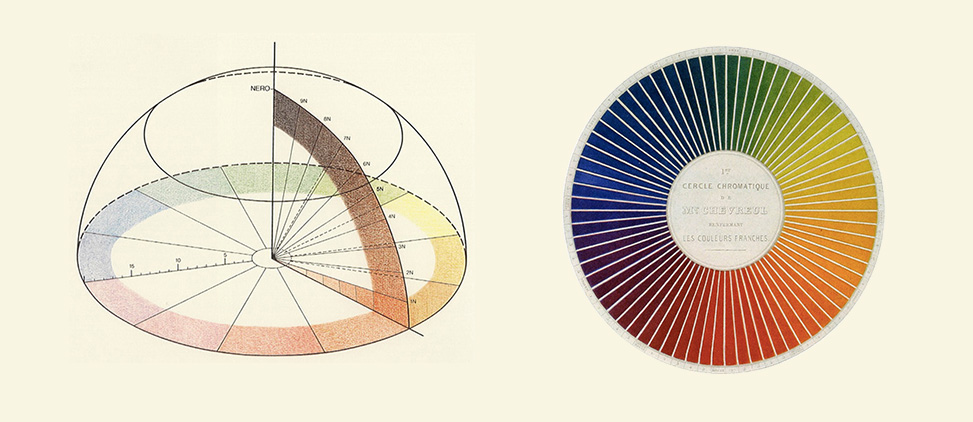

+++
title = "Philosophy of Perception: Color and Color Experience"

date = 2018-12-02T10:23:40+03:00

draft = false
toc = true
type = "docs"  # Do not modify.
layout = "docs"

# Add menu entry to sidebar
[menu.color]
  name = "Syllabus"
  weight = 1
+++

## Course Description

What are we aware of when we perceive? More often than not, philosophers have sought the answer to this question by looking to the nature of perceptual experience itself, asking for instance whether perception is a relation, what accounts for the phenomenal or qualitative character of perceptual experience, and how perceptual experiences manage to represent a mind-independent reality. In this course we will take a different starting point: the nature of the objects of perception themselves. Our primary focus will be _color_, a phenomenon that seems, paradoxically, at once the most familiar and most incomprehensible feature of the world familiar to our experience. Beginning with the science of color vision and the relation between the familiar hues and the structure of our visual system, we'll go on to consider questions of the nature of the colors, their relation to the physical properties of objects that appear colored, and how visual experience gives us knowledge of them. With any luck, we'll also have opportunity to discuss other sensible qualities, for instance sound.

## Course Objectives

The course aims to establish a broad understanding of core issues in the philosophy of color perception and to develop the skills necessary for appreciating these and other issues in the philosophy of mind and perception.

## Learning Outcomes

The successful student will demonstrate the ability:

- to state and articulate, verbally and in writing, major ideas and controversies related to the philosophy of perception,
- to read and critically assess relevant literature,
- to apply these skills to novel cases.

{}
If you keep up with the lectures and readings you will not be assigned anything for which you are unprepared!
{}

## Course Components

Students' success in meeting these course goals will be evaluated on the following bases:

- **Undergraduate students** will be expected to write **two short papers** designed to stimulate in-depth philosophical engagement with one of the major topics discussed in class.

- **Graduate students** will be expected to write _either_ one **short paper** and a 12--15 page **final paper** _or_ a 20 page **final paper**. The final paper will address a substantive philosophical issue concerning the philosophy of perception. Topics and literature will be selected in consultation with me.

- Class participation will be evaluated on the basis of the student's answer to periodic **reading response questions**, which will be distributed in advance and must be turned in prior to the start of the meeting in which the relevant reading is to be discussed. (Students may opt out of reading responses with no penalty a maximum of _three_ times; students who do not opt out of three reading responses may use these to replace lower-scoring responses; with the exception of University excused absences, which must be supported by official documentation, students must complete all other reading responses and attend all other class meetings.)

- Finally, students will give at least one 10--15 minute **in-class presentation**. Presentation topics will be selected in consultation with me.

## Evaluation

Final grades will be determined according to the following rubrics:

### Undergraduate Students

| **Assignment**  | **% of Final Grade**          |
|-----------------|-------------------------------|
| Short Paper 1   | 25%                           |
| Short Paper 2   | 35%                           |
| Presentation    | 20%                           |
| Participation   | 20%                           |
| **Total**       | **100%**                      |

### Graduate Students

| **Assignment**  | **% of Final Grade (Option 1)** | **% of Final Grade (Option 2)** |
|-----------------|------------------------------------------|------------------------------------------|
| Short Paper     | 25%                                      |                                          |
| Final Paper     | 35%                                      | 60%                                      |
| Presentation    | 20%                                      | 20%                                      |
| Participation   | 20%                                      | 20%                                      |
| **Total**       | **100%**                                 | **100%**                                 |

{}
You must complete _all_ assignments in order to pass the course. No extra assignments will be given.
{}

#### Grading Scale

| **Score**  	| **Grade** | **Performance**                                              	    |
|------------ |-----------|-------------------------------------------------------------------|
| 96--100 	  | **A+** 	  | _Surpasses All Grading Criteria_                                	|
| 90--95   	  | **A**  	  | _Satisfies All Grading Criteria; No Errors_                      	|
| 87--89   	  | **A-** 	  | _Satisfies All Grading Criteria; At Least One Minor Error_       	|
| 83--86   	  | **B+** 	  | _Satisfies Most Grading Criteria; Minor Errors_                  	|
| 80--82   	  | **B**  	  | _Satisfies Most Grading Criteria; Perhaps Some Major Errors_     	|
| 77--79   	  | **B-** 	  | _Satisfies Most Grading Criteria; One or More Major Errors_      	|
| 73--76   	  | **C+** 	  | _Satisfies Some Grading Criteria; Some Major Errors_             	|
| 70--72   	  | **C**  	  | _Satisfies Some Grading Criteria; Several Major Errors_          	|
| 67--69   	  | **C-** 	  | _Satisfies Some Grading Criteria; Many Major Errors_             	|
| 64--66   	  | **D+** 	  | _Satisfies Almost No Grading Criteria; At Least One Critical Error_ 	|
| 60--63   	  | **D**  	  | _Satisfies Almost No Grading Criteria; One or More Critical Errors_ 	|
| 0--59    	  | **F**  	  | _Satisfies No Grading Criteria, Incomplete, or Plagiarized_      	|

{}
Final grades are rounded up from the 2nd decimal place; no exceptions will be made.
{}

## Texts & Course Materials

### Required Texts

There is no required text for the course. All readings will be posted to Blackboard.

### Additional Materials

Students seeking a general introduction to the philosophy of perception are encouraged to consult:

- Fish, William. 2010. _Philosophy of Perception: A Contemporary Introduction_. New York & Oxon: Routledge.

Students seeking additional resources are encouraged to consult the bibliographies included with relevant entries in the [_Stanford Enclyclopedia of Philosophy_](plato.stanford.edu).

## Course Policies

### Disabilities and Different Styles of Learning

Education is a pluralistic enterprise: there are several and often incompatible styles of learning. If you believe there is an alternative approach to this material that would better suit your style of learning, do not hesitate to bring it up with me. If you have a disability for which you are or may be requesting accommodation, you are encouraged to contact both me and the Office of Disability Services at [0 (212) 338 10 42](tel:+90(212)3381042) as early as possible in the term. ODS will verify your disability and determine reasonable accommodations for this course.

### Academic Honesty

The goal of this course is to promote and assess _your_ satisfaction of the above-stated course objectives. Cheating not plagiarism will not be tolerated. Students suspected of violating the University's policy on academic integrity, noted below, will be required to participate in the required procedural process as initiated by the instructor. A minimum sanction of a zero score for the quiz, exam, or paper will be imposed.

{}
Be sure you are familiar with KU's complete policy on academic honesty, which is available in the [Student Code of Conduct](https://apdd.ku.edu.tr/en/academic-policies/student-code-of-conduct/)
{}

### Email Policy

Allow me two business days to respond to emails. Please do not email me with questions of philosophical substance---that is what lecture, discussion, and office hours are for---and please consult this syllabus before asking questions about course policy.

<!-- ### Important Links

- [Student Rights \& Responsibilities](https://vpaa.ku.edu.tr/academic/student-code-of-conduct\#stdrights)

- [Academic Grievance Procedure](https://vpaa.ku.edu.tr/academic/grievance-procedures/)

- [Classroom Code of Conduct](https://vpaa.ku.edu.tr/academic/student-code-of-conduct/) -->
