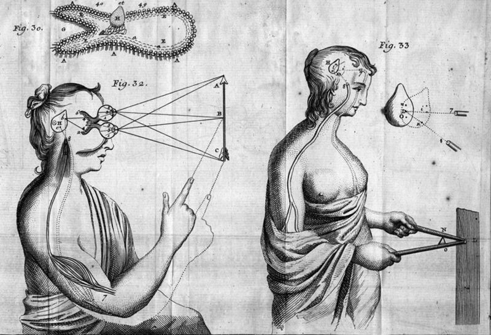

+++
title = "Early Modern Philosophy"

date = 2018-12-02T10:23:40+03:00

draft = false
toc = true
type = "docs"  # Do not modify.
layout = "docs"

# Add menu entry to sidebar
[menu.intro_early_modern]
  name = "Syllabus"
  weight = 1
+++

<!-- {} -->

## Course Description

Philosophy in Western Europe underwent a dramatic shift in the 17th and 18th centuries. Spurred by the ongoing revolution in science and the rediscovery of some lost works of Classical Greek and Roman philosophy, philosophers of this period turned away from the scholastic disputes practiced in the universities of Europe to a whole new set of philosophical questions, including: What am I? How do I relate to my body? Is knowledge possible? If so, where does it come from? For proponents of this new approach to philosophy, exploration of these questions did not require extensive education or training, only the exercise of one's inborn rational faculties. For this reason, philosophy in this period also witnessed another revolution: the increasing influence of women philosophers.

This course will introduce you to the major questions and figures of 17th and 18th century philosophy in Western Europe. We begin with René Descartes, arguably the most important thinker of the 17th century. Descartes' philosophical work posed the questions with which subsequent philosophers would wrestle. After looking at Descartes' answers to these questions, we'll turn to those of his contemporaries and successors, including Malebranche, Cavendish, Leibniz, Berkeley, Locke, and Hume. Finally, we'll close our survey with a look at the most important philosopher of the 18th century: Immanuel Kant, whose transcendental philosophy represents the culmination of Descartes' philosophical legacy.

## Course Objectives

This course will emphasize close reading, analysis, and evaluation of basic philosophical works from the early modern period, with the aim of establishing a broad understanding of the philosophical controversies of that period and cultivating the skills necessary for appreciating these and other topics in philosophy. The successful student will demonstrate the ability:

- to state and articulate, verbally and in writing, philosophical ideas and questions,
- to read and critically assess philosophical literature,
- to identify the elements of an argument and assess it for soundness and validity, and
- to apply these skills to novel cases.

The key to success in this course is to keep up with the assigned readings and to attend and participate regularly in class activities.

{}
If you keep up with the lectures and readings you will not be assigned anything for which you are unprepared!
{}

## Course Components

There are two basic components of this course, **lectures** and **class discussion**. Both components are mandatory, and both are moreover crucial for your success in this course.

### Lectures

The job of my lectures is to introduce you to the theories, concepts, and problems that make up the content of the course. These lectures will be accompanied by slide-show presentations, which I will share with you to use outside of lecture as a guide to reading the assigned texts. Hence, **you will not be expected to come to the lecture having read the material assigned for that day**, but you will be expected to have read the material prior to class discussion.

### Class Discussion

Philosophy is a _discursive_ enterprise: progress in understanding and evaluating philosophical ideas is most effectively made through interpersonal discussion, where you can test, correct, and improve your understanding of those ideas. To help you engage with philosophical ideas in this way, we will meet periodically for  general class discussion of the topics recently introduced in the lecture. Upon arrival at these meetings, students will complete a short **reading reflection** on the texts assigned for that meeting.

## Evaluation

Students will be expected to write two **term tests** and two **term papers**, as well as satisfy requirements for satisfactory **participation** in lectures and discussion meetings. With the exception of University excused absences, which must be supported by official documentation, students are expected to attend all other lectures and discussion meetings.

### Assignments

Final grades will be determined according to the following rubric:

| Assignment      | Percentage of Final Grade |
|-----------------|---------------------------|
| Term Paper 1    | 15%                       |
| Term Paper 2    | 25%                       |
| Term Test 1     | 20%                       |
| Term Test 2     | 25%                       |
| Participation   | 15%                       |
| **Total**       | **100%**                  |

{}
You must complete _all_ assignments in order to pass the course!
{}

### Grading Scale

| **Score**  	| **Grade** | **Performance**                                              	    |
|------------ |-----------|-------------------------------------------------------------------|
| 96--100 	  | **A+** 	  | _Surpasses All Grading Criteria_                                	|
| 90--95   	  | **A**  	  | _Satisfies All Grading Criteria; No Errors_                      	|
| 87--89   	  | **A-** 	  | _Satisfies All Grading Criteria; At Least One Minor Error_       	|
| 83--86   	  | **B+** 	  | _Satisfies Most Grading Criteria; Minor Errors_                  	|
| 80--82   	  | **B**  	  | _Satisfies Most Grading Criteria; Perhaps Some Major Errors_     	|
| 77--79   	  | **B-** 	  | _Satisfies Most Grading Criteria; One or More Major Errors_      	|
| 73--76   	  | **C+** 	  | _Satisfies Some Grading Criteria; Some Major Errors_             	|
| 70--72   	  | **C**  	  | _Satisfies Some Grading Criteria; Several Major Errors_          	|
| 67--69   	  | **C-** 	  | _Satisfies Some Grading Criteria; Many Major Errors_             	|
| 64--66   	  | **D+** 	  | _Satisfies Almost No Grading Criteria; At Least One Fatal Error_ 	|
| 60--63   	  | **D**  	  | _Satisfies Almost No Grading Criteria; One or More Fatal Errors_ 	|
| 0--59    	  | **F**  	  | _Satisfies No Grading Criteria, Incomplete, or Plagiarized_      	|

## Texts & Course Materials

### Required Texts

Most of the readings for this course are collected in:

- Ariew, Roger and Eric Watkins, eds. _Modern Philosophy: an Anthology of Primary Sources_, 3rd ed. Indianapolis, Ind: Hackett Pub. Co, 2009.
<!-- 2. Atherton, Margaret. _Women Philosophers of the Early Modern Period_. Indianapolis: Hackett Pub. Co, 1994. -->

It is available at Pandora. Additional readings will be posted to Blackboard.

### Additional Materials

Students looking for additional study materials are encouraged to consult the [Stanford Encyclopedia of Philosophy](https://plato.stanford.edu/). I am also compiling a playlist of YouTube videos related to modern philosophy; there is a link to it on Blackboard.

## Course Policies

### Disabilities and Different Styles of Learning

Education is a pluralistic enterprise: there are several and often incompatible styles of learning. If you believe there is an alternative approach to this material that would better suit your style of learning, do not hesitate to bring it up with me. If you have a disability for which you are or may be requesting accommodation, you are encouraged to contact both me and the Office of Disability Services at [0 (212) 338 10 42](tel:+90(212)3381042) as early as possible in the term. ODS will verify your disability and determine reasonable accommodations for this course.

### Academic Honesty

The goal of this course is to promote and assess _your_ satisfaction of the above-stated course objectives. Cheating not plagiarism will not be tolerated. Students suspected of violating the University's policy on academic integrity, noted below, will be required to participate in the required procedural process as initiated by the instructor. A minimum sanction of a zero score for the quiz, exam, or paper will be imposed.

{}
Be sure you are familiar with KU's complete policy on academic honesty, which is available in the [Student Code of Conduct](https://vpaa.ku.edu.tr/academic/student-code-of-conduct\#09)
{}

### Email Policy

Allow me two business days to respond to emails. Please do not email me with questions of philosophical substance---that is what lecture, discussion, and office hours are for---and please consult this syllabus before asking questions about course policy.

### Important Links

- [Student Rights \& Responsibilities](https://vpaa.ku.edu.tr/academic/student-code-of-conduct\#stdrights)

- [Academic Grievance Procedure](https://vpaa.ku.edu.tr/academic/grievance-procedures/)

- [Classroom Code of Conduct](https://vpaa.ku.edu.tr/academic/student-code-of-conduct/)
