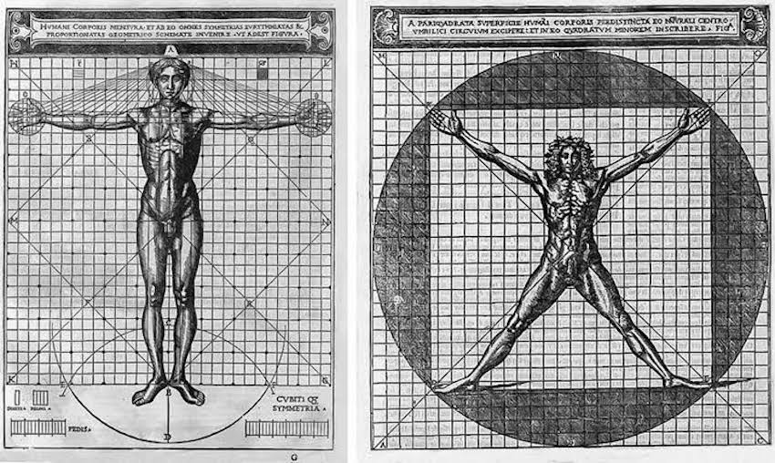

+++
title = "The Problem of the Criterion"

date = 2018-12-02T10:23:40+03:00

draft = false
toc = true
type = "docs"  # Do not modify.
layout = "docs"

# Add menu entry to sidebar
[menu.the_problem_of_the_criterion]
  name = "Syllabus"
  weight = 1
+++

<!-- {} -->

## Course Description

Is knowledge possible for us, and if so, how? For many epistemologists, both ancient and modern, whether and how knowledge is attainable depends on whether we possess some criterion or standard by which to judge what _is_ the case from what merely _appears_ to be the case. This idea, that knowledge requires a _criterion of truth_, has its origins in antiquity, in Hellenistic debates between so-called Dogmatists and Skeptics about whether human beings possess---or can ever possess---such a criterion. Our aim in this course will be to explore the ancient roots of this "problem of the criterion", in order to gain a better understanding of the various arguments and positions of the dogmatic and skeptical Hellenistic schools, as well as the prehistory of this debate in Hellenic figures such as Protagoras, Democritus, and, more controversially, Plato and Aristotle.

## Course Objectives

The course aims to establish a broad understanding of core issues in ancient epistemology and to develop the skills necessary for appreciating these and other issues in ancient and contemporary philosophy.

## Learning Outcomes

The successful student will demonstrate the ability:

- to state and articulate, verbally and in writing, major ideas and controversies related to ancient epistemology,
- to read and critically assess relevant primary and secondary literature,
- to apply these skills to novel cases.

{}
If you keep up with the lectures and readings you will not be assigned anything for which you are unprepared!
{}

## Course Components

Students' success in meeting these course goals will be evaluated on the following bases:

- **Undergraduate students** will be expected to write **two passage commentaries**. The commentaries are designed to stimulate in-depth historical and philosophical engagement with one of the major passages discussed in class and relevant secondary literature.

- **Graduate students** will be expected to write _either_ a **passage commentary** and a 12--15 page **final paper** _or_ a 20 page **final paper**. The final paper will address a substantive interpretive issue concerning Hellenistic epistemology and/or related philosophical issues. Topics and secondary literature will be selected in consultation with me.

- Class participation will be evaluated on the basis of the student's answer to periodic **reading response questions**, which will be distributed in advance and must be turned in prior to the start of the meeting in which the relevant reading is to be discussed. (Students may opt out of reading responses with no penalty a maximum of _three_ times; students who do not opt out of three reading responses may use these to replace lower-scoring responses; with the exception of University excused absences, which must be supported by official documentation, students must complete all other reading responses and attend all other class meetings.)

- Finally, students will give at least one 10--15 minute **in-class presentation**. Presentation topics and secondary literature will be selected in consultation with me.

## Evaluation

Final grades will be determined according to the following rubrics:

### Undergraduate Students

| **Assignment**  | **% of Final Grade**          |
|-----------------|-------------------------------|
| Commentary 1    | 25%                           |
| Commentary 2    | 35%                           |
| Presentation    | 20%                           |
| Participation   | 20%                           |
| **Total**       | **100%**                      |

### Graduate Students

| **Assignment**  | **% of Final Grade (Option 1)** | **% of Final Grade (Option 2)** |
|-----------------|------------------------------------------|------------------------------------------|
| Commentary      | 25%                                      |                                          |
| Final Paper     | 35%                                      | 60%                                      |
| Presentation    | 20%                                      | 20%                                      |
| Participation   | 20%                                      | 20%                                      |
| **Total**       | **100%**                                 | **100%**                                 |

{}
You must complete _all_ assignments in order to pass the course!
{}

#### Grading Scale

| **Score**  	| **Grade** | **Performance**                                              	    |
|------------ |-----------|-------------------------------------------------------------------|
| 96--100 	  | **A+** 	  | _Surpasses All Grading Criteria_                                	|
| 90--95   	  | **A**  	  | _Satisfies All Grading Criteria; No Errors_                      	|
| 87--89   	  | **A-** 	  | _Satisfies All Grading Criteria; At Least One Minor Error_       	|
| 83--86   	  | **B+** 	  | _Satisfies Most Grading Criteria; Minor Errors_                  	|
| 80--82   	  | **B**  	  | _Satisfies Most Grading Criteria; Perhaps Some Major Errors_     	|
| 77--79   	  | **B-** 	  | _Satisfies Most Grading Criteria; One or More Major Errors_      	|
| 73--76   	  | **C+** 	  | _Satisfies Some Grading Criteria; Some Major Errors_             	|
| 70--72   	  | **C**  	  | _Satisfies Some Grading Criteria; Several Major Errors_          	|
| 67--69   	  | **C-** 	  | _Satisfies Some Grading Criteria; Many Major Errors_             	|
| 64--66   	  | **D+** 	  | _Satisfies Almost No Grading Criteria; At Least One Critical Error_ 	|
| 60--63   	  | **D**  	  | _Satisfies Almost No Grading Criteria; One or More Critical Errors_ 	|
| 0--59    	  | **F**  	  | _Satisfies No Grading Criteria, Incomplete, or Plagiarized_      	|

{}
Final grades are rounded up from the 2nd decimal place; no exceptions will be made.
{}

## Texts & Course Materials

### Required Texts

There is one required text for the course:

- Brittain, Charles (ed.). 2006. _Cicero: On Academic Scepticism_. Indianapolis, IN: Hackett Publishing Co.

It is available at Pandora.

### Additional Materials

Additional readings will be posted to Blackboard. Scholarship on ancient epistemology since the late 20^th^ century has been for the most part excellent. Students seeking additional resources are encouraged to consult the bibliographies included with relevant entries in the [_Stanford Enclyclopedia of Philosophy_](plato.stanford.edu), as well as the following resources, which are on hold at the library:

- Algra, Keimpe, ed. 1999. _The Cambridge History of Hellenistic Philosophy_. Cambridge: Cambridge University Press.
- Schofield, Malcolm, Myles Burnyeat, and Jonathan Barnes, eds. 1980. _Doubt and Dogmatism: Studies in Hellenistic Epistemology_. Oxford: Clarendon Press.
- Annas, Julia and Jonathan Barnes, eds. 2000. _Sextus Empiricus: Outlines of Scepticism_. Cambridge: Cambridge University Press.
- Bett, Richard, ed. 2005. _Sextus Empiricus: Against the Logicians_. Cambridge: Cambridge University Press.

## Course Policies

### Disabilities and Different Styles of Learning

Education is a pluralistic enterprise: there are several and often incompatible styles of learning. If you believe there is an alternative approach to this material that would better suit your style of learning, do not hesitate to bring it up with me. If you have a disability for which you are or may be requesting accommodation, you are encouraged to contact both me and the Office of Disability Services at [0 (212) 338 10 42](tel:+90(212)3381042) as early as possible in the term. ODS will verify your disability and determine reasonable accommodations for this course.

### Academic Honesty

The goal of this course is to promote and assess _your_ satisfaction of the above-stated course objectives. Cheating not plagiarism will not be tolerated. Students suspected of violating the University's policy on academic integrity, noted below, will be required to participate in the required procedural process as initiated by the instructor. A minimum sanction of a zero score for the quiz, exam, or paper will be imposed.

{}
Be sure you are familiar with KU's complete policy on academic honesty, which is available in the [Student Code of Conduct](https://apdd.ku.edu.tr/en/academic-policies/student-code-of-conduct/)
{}

### Email Policy

Allow me two business days to respond to emails. Please do not email me with questions of philosophical substance---that is what lecture, discussion, and office hours are for---and please consult this syllabus before asking questions about course policy.

<!-- ### Important Links

- [Student Rights \& Responsibilities](https://vpaa.ku.edu.tr/academic/student-code-of-conduct\#stdrights)

- [Academic Grievance Procedure](https://vpaa.ku.edu.tr/academic/grievance-procedures/)

- [Classroom Code of Conduct](https://vpaa.ku.edu.tr/academic/student-code-of-conduct/) -->
