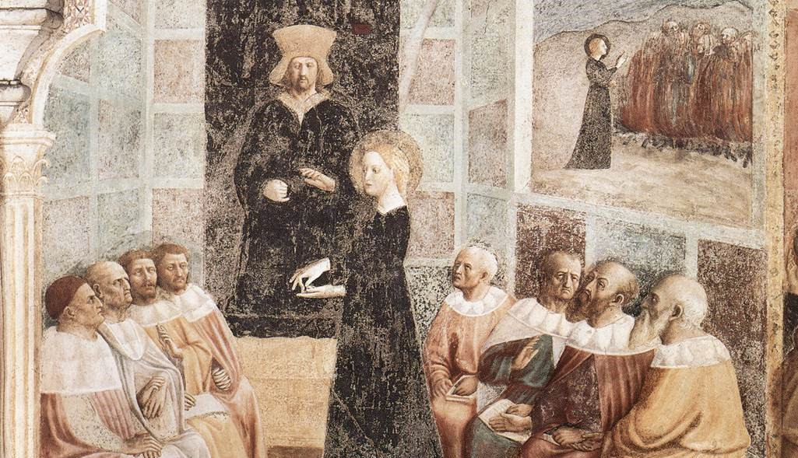

+++
title = "Teaching Dossier"

date = 2018-12-02T10:23:40+03:00

draft = false
toc = false
type = "docs"  # Do not modify.
layout = "docs"

# Add menu entry to sidebar
[menu.dossier]
  linktitle = "Teaching Dossier"
  weight = 1
  # parent = "Teaching Dossier"
+++

An up-to-date version of my teaching dossier, including complete data from student evaluations. Use the menu on the left-hand side of the page to navigate to elements of the dossier.
