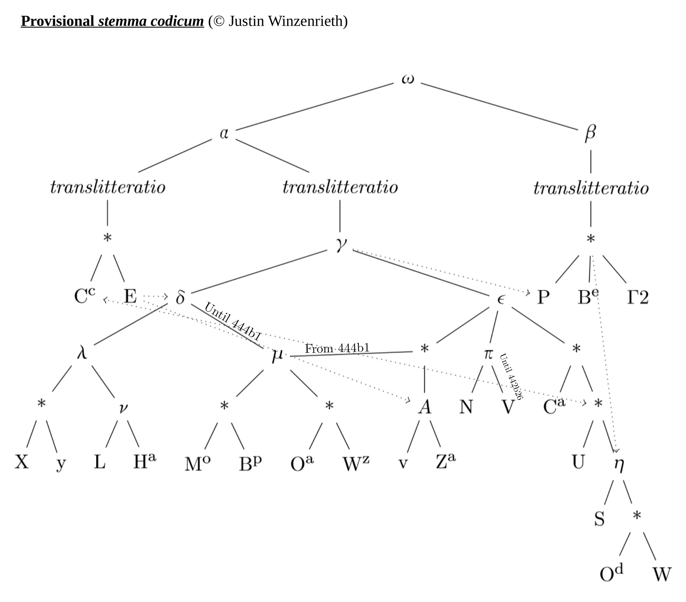

+++
title = "Notes on Aristotle, De Sensu"

date = 2018-12-02T10:23:40+03:00

draft = false
toc = true
type = "docs"  # Do not modify.
layout = "docs"

# Add menu entry to sidebar
[menu.sensnotes]
  name = "Stemma & Sigla"
  weight = 1
+++

# Stemma & Sigla

<!-- ## Conspectus Siglorum -->

## Families

|   |                                                                    |
|---------|--------------------------------------------------------------------|
| _α_     | ECc XyLHaMoBpOaWzvZaNCaUSOdW + (until approximately 442b26) V                                                        |
| _β_     | BePΓ2                                                   |
| _γ_     | XyLHaMoBpOaWzvZaNCaUSOdW + (until approximately 442b26) V                                                                              |
| _δ_     | XyLHa + (until approximately 444b1) MoOaBpWz                                    |
| _ε_     | vZaNCaUSOdW + (from approximately 444b1) MoOaBpWz + (until approximately 442b26) V                                                        |
| _λ_     | XyLHa                                                   |
| _ν_     | LHa                                                     |
| _μ_     | MoOaBpWz               |
| _A_     | vZa                                                     |
| _π_     | N + (until approximately 442b26) V                                 |
| _η_     | SOdW                                                    |

## Manuscripts

|         |                                                              |
|---------------|--------------------------------------------------------------|
| E             | _Paris. gr._ 1853, mid-10th century               |
| Cc | _Paris. Suppl. gr._ 314, _ca._ 1300                          |
| P             | _Vat. gr._ 1339, first half of the 14th century   |
| Be | _Berol. Phil._ 1507 (ff.\ 72v--78v, until 441b12), _ca._ 1440--1453                                                |
| Γ2            | Lost manuscript used by William of Moerbeke                  |
| X             | _Ambros._ H50_sup._, end of the 12th century--beginning of the 13th century                                       |
| y             | _Paris. gr._ 2034, 13th century                   |
| L             | _Vat. gr._ 253, _ca._ 1300                                   |
| Ha | Marc. gr. Z 214, ca. 1290 –1300                              |
| Mo | _Sinod. gr._ 240, third quarter of the 15th century                                                                        |
| Bp | _Berol. Phil._ 1507 (ff. 79r--85v, from 441b12), ca. 1455                                                              |
| Oa | _Oxon. Auct._ T. 4. 24 (Misc. 262), 15th century  |
| Wz | _Vind. Phil. gr._ 213, after 1460                            |
| v             | _Laurent. Plut._ 87.20, 14th century              |
| Za | _Laurent. Plut._ 87.21, 14th century              |
| N             | _Vat. gr._ 258, ca. 1300                                     |
| V             | _Vat. gr._ 266, ca. 1300                                     |
| Ca | _Laurent. Plut._ 87.4, ca. 1135-1140                         |
| U             | _Vat. gr._ 260, 12th--13th century     |
| S             | _Laurent. Plut._ 81.01, ca. 1250--1350                       |
| Od | _Marc. gr. Z_ 209, beginning of the 14th century  |
| W             | _Vat. gr._ 1026, 13th or 14th century  |
