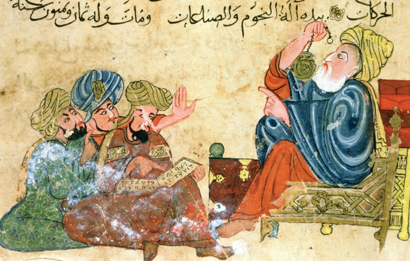

+++
title = "Research Statement"

date = 2018-12-02T10:23:40+03:00

draft = false
toc = true
type = "docs"  # Do not modify.
layout = "docs"

# Add menu entry to sidebar
[menu.research]
  linktitle = "Research Statement"
  weight = 1
  # parent = "Research Statement"
+++

# Overview

My current research focuses on two related topics in Aristotle's psychology and natural philosophy. The first, which develops themes from my dissertation, concerns Aristotle’s views on the epistemic value of sense perception. The second concerns the status of soul as an explanatory principle in Aristotle’s natural science. Below I provide an overview of these topics. In [Papers]() I detail some papers in progress or projected on these and related topics, and in [Book Project]() I outline a book project, _Aristotle on Perceptual Discrimination_, that draws together the major topics of my research.

## Aristotle's Theory of Perceptual Discrimination

Aristotle conceives of perception as a process that is at once causal and “cognitive,” a means by which the perceiver comes to know something about the world. Disputes over perception’s causal aspect have roiled for decades, but until recently little scholarly attention has been paid to its cognitive aspect. I aim to increase our understanding of this crucial aspect of Aristotle’s celebrated theory of perception by elucidating one of its most important and contentious theses: that perception is a _discriminative_ capacity of soul.

I laid the foundations for this project in my doctoral dissertation, _Aristotle’s Case for Perceptual Knowledge_. Against a range of competing interpretations, I argued that Aristotle’s thesis, and the theory of perceptual discrimination he develops in support of it, is a direct response to a well-known Platonic argument against perceptual knowledge. To say, for instance, that sight “discriminates” color is on Aristotle’s view to say that seeing the color of a body is a way of _knowing_ its color. This interpretation, I argued, enables us to see why Aristotle thinks it is by discriminating that the senses promote animals’ diverse practical and intellectual goals, and so why he also rejects the view, almost universally accepted by his predecessors, that perception is an impediment to knowledge.

I am at work on a series of papers elaborating this approach to the cognitive aspect of perception in Aristotle’s psychology, the ontology of color and other sensible qualities on which it relies, and its role in teleological explanations of the value of perception for rational and non-rational animals. One paper, "Reduction and Revelation in Aristotle's Science of Sensible Qualities", will be published in a volume currently in preparation on Aristotle's _De Sensu_. Another, “Perception and Hypothetical Necessity in _Posterior Analytics_ 2.19," is being revised for resubmission to _Ancient Philosophy_. Additionally, I am planning a book, _Aristotle on Perceptual Discrimination_, aimed at situating Aristotle’s theory of perceptual discrimination within his general teleological approach to explaining the natural attributes of living things by reference to the contributions those attributes make to the ends living things naturally pursue.

## Soul as a "Complex Activity" in Aristotle's Natural Science

Commentators have found a conflict between the theory and explanatory practice of Aristotle’s biology. In theory, the soul of a living thing---its form and essence---is supposed to explain each of its natural attributes, but in practice Aristotle seems to admit that some of a living thing’s natural attributes are due, not to its soul, but to its matter. I argue that this conflict is only apparent. We can see the soul as the basis even of these explanations if we take seriously Aristotle’s claim that the soul is a “certain complex activity,” a diverse collection of vital functions aimed at a single, teleologically primary goal, such as reproduction.

I am at work on a series of papers aimed at elucidating this “complex activity” model of soul and its role in Aristotle’s natural science. The first, which appears in Murgier, Louguet, and Guyomarc’h (eds.), _Aristote et l’âme humaine. Lectures de De Anima III offertes à Michel Crubellier_ (Peeters, 2020), argues that Aristotle uses the complex activity model in _De Anima_ to explain the psychological attributes of living things. In subsequent papers, I plan to extend this interpretation to Aristotle’s explanations of animals’ physiological attributes in the _Generation of Animals_ and the _Parts of Animals_, where the soul is presented respectively as the efficient and final cause of these attributes.
